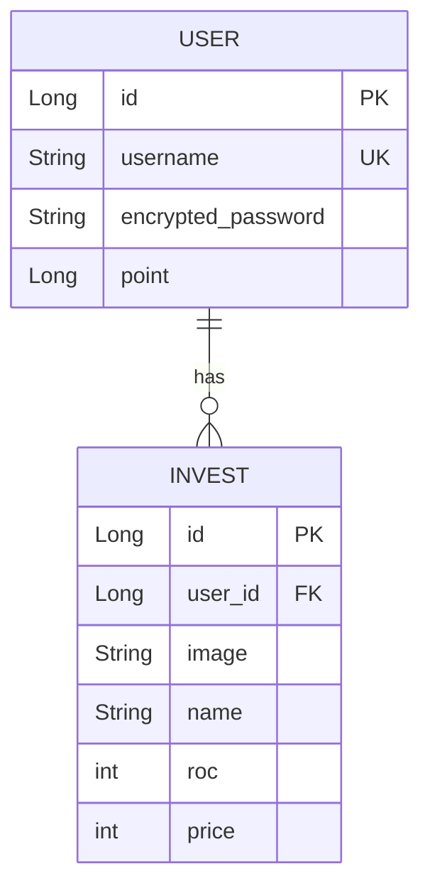

# backend

```mermaid
    erDiagram
        USER {
            Long id PK
            String username UK
            String encrypted_password
            Long point
        }
    
        INVEST {
            Long id PK
            Long user_id FK
            String image
            String name
            int roc
            int price
        }
    
    USER ||--o{ INVEST: "has"
``` 