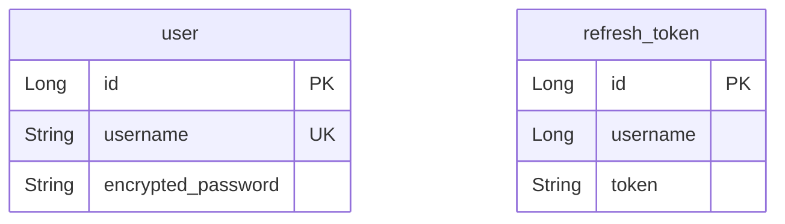

# backend

```mermaid
    erDiagram
        user {
            Long id PK
            String username UK
            String encrypted_password
        }
        
        refresh_token {
            Long id PK
            Long username
            String token
        }
``` 