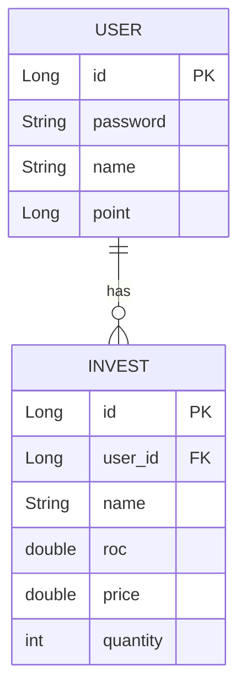

# backend

```mermaid
    erDiagram
        USER {
            Long id PK
            String password
            String name
            Long point
        }
    
        INVEST {
            Long id PK
            Long user_id FK
            String name
            double roc
            double price
            int quantity
        }
    
        USER ||--o{ INVEST: "has"
``` 